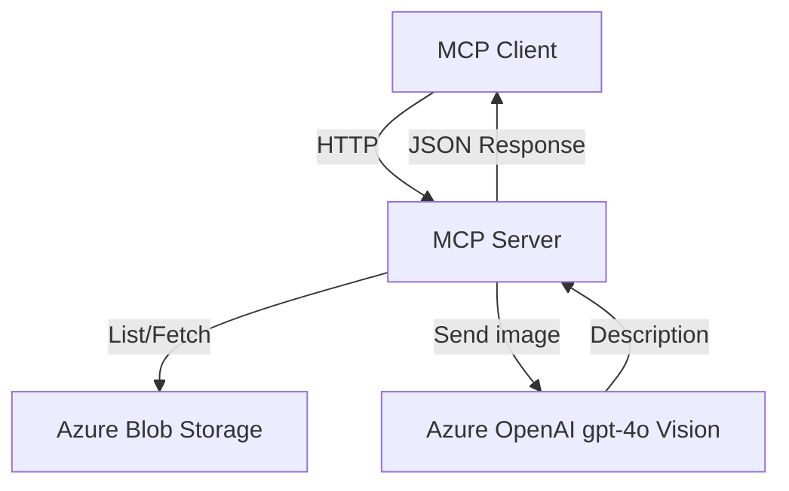

# MCP on Azure – Model Context Server that reads from Blob Storage and describes images with Azure OpenAI

Production-ready sample for running a minimal **MCP Server** on Azure.
It exposes two tools:

* **`list_captain_files`** – list all blob names in a container
* **`describe_blob`** – generate a short description for an image blob using **Azure OpenAI** (`gpt-4o`)

---

## ✨ What you get

* A minimal MCP Server built with **Express.js**.
* Secure access to **Azure Blob Storage** using a connection string.
* Server-side calls to **Azure OpenAI** vision models for image description.
* Example `.env.example` for easy setup.
* PowerShell & cURL commands for quick testing.

## 🧱 Architecture



MCP Client (Copilot, Inspector, etc.) sends HTTP requests.

This Server (Express.js) handles /tools endpoints.

Server fetches the file from Azure Blob Storage.

Sends it to Azure OpenAI GPT-4o for a short, clear description.

## 📦 Prerequisites

* **Node.js** 18+ (or 20/22)
* **Azure Storage Account** with a container (e.g., `captain-azure`) containing images
* **Azure OpenAI** resource with a **gpt-4o** deployment
* Access keys & endpoint for both services

---

## 🔐 Environment Variables (`.env`)

```env
AZURE_STORAGE_CONNECTION_STRING=DefaultEndpointsProtocol=https;AccountName=<name>;AccountKey=<key>;EndpointSuffix=core.windows.net
CONTAINER_NAME=captain-azure
AZURE_OPENAI_ENDPOINT=https://<your-openai>.openai.azure.com
AZURE_OPENAI_KEY=<your-openai-key>
AZURE_OPENAI_DEPLOYMENT_NAME=gpt-4o
AZURE_OPENAI_API_VERSION=2024-02-15-preview
```

---

## 🚀 Install & Run

```bash
git clone https://github.com/OfekBenEliezer/mcp-on-azure.git
cd mcp-on-azure
npm install
node server.js
# MCP Server running on: http://localhost:3333
```

---

## 📂 List blobs

**PowerShell**

```powershell
Invoke-RestMethod -Uri "http://localhost:3333/tools/list_captain_files" `
  -Method Post `
  -ContentType "application/json"
```

**cURL**

```bash
curl -s -X POST http://localhost:3333/tools/list_captain_files \
  -H "Content-Type: application/json"
```

---

## 🖼 Describe a blob

**PowerShell**

```powershell
Invoke-RestMethod -Uri "http://localhost:3333/tools/describe_blob" `
  -Method Post `
  -Body (@{ blobName = "CertWebinar.png" } | ConvertTo-Json) `
  -ContentType "application/json"
```

**cURL**

```bash
curl -s -X POST http://localhost:3333/tools/describe_blob \
  -H "Content-Type: application/json" \
  -d '{"blobName":"CertWebinar.png"}'
```

**Expected output**

```json
{
  "description": "A short, clear sentence describing the image."
}
```

---

## 🛡️ Security Notes

* Never commit keys or secrets.
* If blobs are private, generate SAS URLs with short TTL.
* Restrict CORS and ingress when running in production.
* For enterprise scenarios, prefer **Managed Identity** over raw keys.

---

## 📜 License

MIT License – free to use, modify, and distribute with attribution.

---

**👨‍✈️ Built by Captain Azure – Ofek Ben Eliezer**
